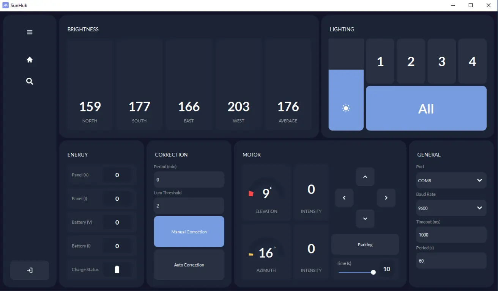
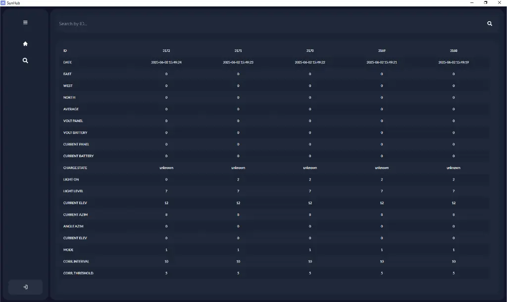
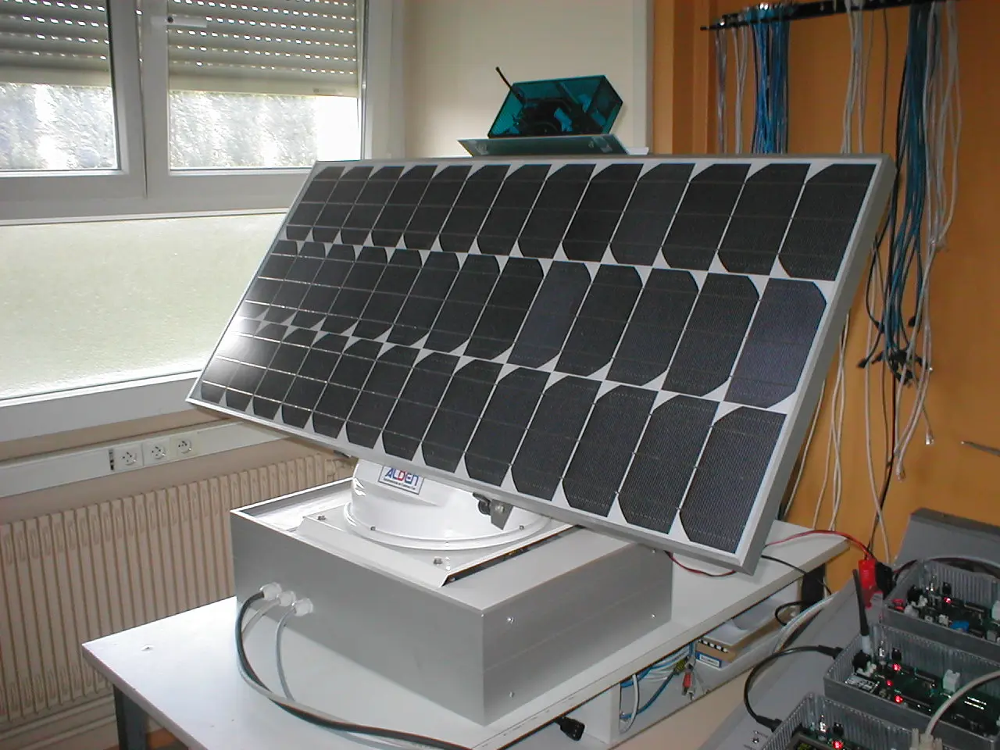
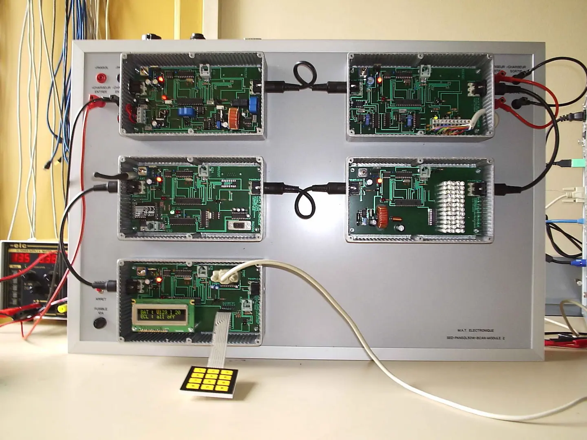

# SunHub: Solar Monitoring & Control System
**SunHub** is a modern PyQt6 application designed to monitor, control, and analyze solar-powered lighting systems installed on offshore oil platforms. It consolidates legacy tools into a unified, modular interface compatible with current operating systems.

<div align="center">
  
  
  
  
</div>

## Table of Contents 📋

<details>
  <summary>Table of Contents</summary>

- [System Description](#system-description)
- [Problem Statement](#problem-statement)
- [Project Objectives](#project-objectives)
- [Key Features](#key-features)
- [Installation](#installation)

</details>

---

## System Description

The **Pansol CAN** system (by *MAT Électronique*) includes:

- Motorized solar panels with azimuth and elevation control.
- Electronic modules communicating over a CAN bus.
- Management of solar energy production and emergency lighting via a 64-LED white light block.


## Problem Statement

Legacy software tools (`Console de maintenance` and `CAN Sniffer`) are outdated, Windows XP–dependent, and lack:

- Real-time data visualization.
- Persistent logging and archival.
- Integration capabilities with modern web systems.


## Project Objectives

- Replace legacy tools with a single, intuitive PyQt6 application.
- Enable robust serial and CAN communication.
- Support CAN frame visualization, injection, and logging.
- Store system data in a modern SQL database.
- Provide optional web access to system data and logs.

## Key Features

- USB serial communication.
- Real-time monitoring of solar energy production.
- Diagnostics for lighting, motors, and system corrections.
- Manual and automatic motor positioning controls.
- CAN frame search and filtering.
- Modular PyQt6 UI with custom widgets.
- Optional REST API for web dashboard integration.


## Installation

```bash
git clone https://github.com/nxrddinbnh/bts-project.git
```
```bash
cd bts-project/app
```
```bash
pip install -r requirements.txt
```
```bash
python -B src/main.py
```
